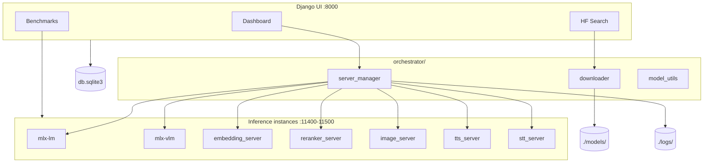

# MLX Server

**Local-first orchestrator for Apple Silicon MLX inference.**

MLX Server is a Django web application that downloads Hugging Face models, launches OpenAI-compatible inference endpoints on your Mac, and benchmarks them — all without sending data to the cloud. Think of it as a lightweight control plane for your on-device LLM, VLM, embedding, reranker, and image-generation stack.

Built for developers who want **privacy**, **predictable ports**, and a **single UI** to manage multiple MLX backends at once.

---

## Why MLX Server?

Running MLX models locally usually means juggling CLI commands, virtual environments, and ad-hoc scripts. MLX Server centralizes that workflow:

- **Search & download** MLX models from Hugging Face into `./models/`
- **Launch** one or more inference servers on dedicated ports (`11400–11500`)
- **Monitor** live logs and instance status from the browser
- **Benchmark** throughput and latency with integrated [llmbenchmark](https://github.com/tcs211/llmbenchmark)
- **Integrate** with [LiteLLM](https://github.com/BerriAI/litellm), Open WebUI, or any OpenAI-compatible client

Everything runs on your machine. Model weights, logs, and SQLite state stay local.

---

## Features

| Capability | Description |
|------------|-------------|
| **Model hub browser** | Search Hugging Face, estimate RAM from quantization, download in the background |
| **Multi-instance** | Run several models in parallel on different ports |
| **Smart detection** | Auto-detect text, multimodal, embedding, reranker, and image-generation capabilities |
| **Reliable lifecycle** | Process-group shutdown + port verification on stop (no ghost listeners) |
| **Benchmarks** | Presets (quick / standard / full) against running instances or custom endpoints |
| **Auth** | Django session login to protect the dashboard |

---

## Launch modes

MLX Server supports seven inference backends, each exposing standard HTTP APIs:

| Mode | Backend | API |
|------|---------|-----|
| **TEXT** | [mlx-lm](https://github.com/ml-explore/mlx-lm) | `POST /v1/chat/completions` |
| **MULTIMODAL** | [mlx-vlm](https://github.com/ml-explore/mlx-vlm) | `POST /v1/chat/completions` (vision) |
| **EMBEDDING** | [mlx-embeddings](https://github.com/Blaizzy/mlx-embeddings) | `POST /v1/embeddings` |
| **RERANKER** | local-reranker + custom Jina server | `POST /v1/rerank` |
| **IMAGE** | [mflux](https://github.com/filipstrand/mflux) | `POST /v1/images/generations` |
| **TTS** | [mlx-audio](https://github.com/Blaizzy/mlx-audio) (Kokoro) | `POST /v1/audio/speech` |
| **STT** | [mlx-audio](https://github.com/Blaizzy/mlx-audio) (Whisper) | `POST /v1/audio/transcriptions` |

Reranker routing is automatic:

- **`jinaai/jina-reranker-v3-mlx`** style models → [local-reranker](https://github.com/olafgeibig/local-reranker)
- **`JinaForRanking`** mlx-community models (e.g. mxfp4) → built-in `reranker_server.py`

Image routing is automatic from the model folder name:

- **FLUX.1** (`flux`, `schnell`, `dev`, `krea`) → `Flux1` via mflux
- **Z-Image Turbo** → `ZImageTurbo`
- **FLUX.2 Klein** → `Flux2Klein`
- **Qwen-Image** → `QwenImage`

Quantization (`4bit`, `8bit`, …) is inferred from the folder name when present.

---

## Architecture



---

## Requirements

- **Hardware**: Apple Silicon Mac (M1 / M2 / M3 / M4)
- **OS**: macOS 14+
- **Python**: 3.12+ (recommended; compatible with mflux and local-reranker)
- **Disk**: Depends on models (plan for tens of GB per large checkpoint)

---

## Quick start

### 1. Clone and install

```bash
git clone https://github.com/assiadialeb/mlx-server.git
cd mlx-server

python3 -m venv venv
source venv/bin/activate
pip install -r requirements.txt
```

> **Note — Python 3.14 + local-reranker**  
> `local-reranker` officially requires Python `<3.14`. If install fails, run:
> ```bash
> pip install -r requirements.txt --ignore-requires-python
> ```

### 2. Initialize the database

```bash
python manage.py migrate
python manage.py createsuperuser
```

### 3. Run the orchestrator

```bash
python manage.py runserver
```

Open **http://127.0.0.1:8000** and sign in with your superuser account.

### 4. Download and launch a model

1. Go to **Search** and find a model (e.g. `mlx-community/Qwen2.5-7B-Instruct-4bit`)
2. Click **Download** — files land in `./models/<model-name>/`
3. On the **Dashboard**, pick a launch mode and click **Start**
4. Point your client at `http://127.0.0.1:<port>/v1`

---

## Usage examples

### Chat completions (TEXT mode)

```bash
curl http://127.0.0.1:11437/v1/chat/completions \
  -H "Content-Type: application/json" \
  -d '{
    "model": "default_model",
    "messages": [{"role": "user", "content": "Hello!"}],
    "max_tokens": 128
  }'
```

### Embeddings (EMBEDDING mode)

```bash
curl http://127.0.0.1:11438/v1/embeddings \
  -H "Content-Type: application/json" \
  -d '{
    "model": "default_model",
    "input": ["Local embeddings on Apple Silicon"]
  }'
```

### Rerank (RERANKER mode)

```bash
curl http://127.0.0.1:11439/v1/rerank \
  -H "Content-Type: application/json" \
  -d '{
    "query": "What is Python?",
    "documents": [
      "Python is a programming language.",
      "The weather is sunny today."
    ],
    "top_n": 2,
    "return_documents": true
  }'
```

### Image generation (IMAGE mode)

```bash
curl http://127.0.0.1:11440/v1/images/generations \
  -H "Content-Type: application/json" \
  -d '{
    "prompt": "A luxury food photograph, studio lighting",
    "size": "1024x1024",
    "n": 1,
    "response_format": "b64_json",
    "num_inference_steps": 4
  }'
```

Response images are returned as base64 PNG in `data[].b64_json`. First launch may take 20–30s while mflux loads weights.

### Text-to-speech (TTS mode)

Kokoro requires **`misaki[en]`** for G2P (English + espeak for French, Spanish, etc.). It is included in `requirements.txt`; after upgrading dependencies, **restart the TTS server**.

**Multilingual:** set `lang_code` in the server UI (`f` = French, `a` = American English, …). Default is French (`ff_siwis`).

LiteLLM and other OpenAI clients often send voices like `alloy` or `nova`. The TTS server **maps them automatically** to the closest Kokoro voice for the configured language (e.g. `alloy` + French → `ff_siwis`).

For long French texts, split paragraphs with newlines — espeak-based languages truncate very long inputs.

Recommended model: `mlx-community/Kokoro-82M-bf16`.

```bash
curl http://127.0.0.1:11441/v1/audio/speech \
  -H "Content-Type: application/json" \
  -d '{
    "model": "Kokoro-82M-bf16",
    "input": "Hello from MLX Server.",
    "voice": "af_heart",
    "speed": 1.0
  }' \
  --output speech.wav
```

List installed Kokoro voices: `GET /v1/audio/voices`.

### Speech-to-text (STT mode)

Recommended model: `mlx-community/whisper-large-v3-turbo-asr-fp16`.

```bash
curl http://127.0.0.1:11442/v1/audio/transcriptions \
  -F "file=@sample.wav" \
  -F "model=whisper-large-v3-turbo-asr-fp16" \
  -F "response_format=json"
```

### LiteLLM proxy

#### Reranker

Register the reranker in [LiteLLM](https://docs.litellm.ai/) via the UI:

1. **Credentials** → provider **vLLM (Hosted vLLM)**
2. **API Base**: `http://127.0.0.1:<port>/v1`
3. **Add Model** → `hosted_vllm/your-model-name`, mode **Rerank**

Then call LiteLLM's `/rerank` endpoint with your proxy model name.

#### Text-to-speech (Kokoro)

Use provider **`openai`** (OpenAI-compatible), **not** chat mode. The backend model id is whatever `/v1/models` returns (often `kokoro`).

`config.yaml` example (LiteLLM in Docker → use `host.docker.internal` instead of `127.0.0.1`):

```yaml
model_list:
  - model_name: kokoro-tts
    litellm_params:
      model: openai/kokoro
      api_base: http://host.docker.internal:11444/v1
      api_key: sk-local
    model_info:
      mode: audio_speech
```

Test through LiteLLM proxy:

```bash
curl http://127.0.0.1:4000/v1/audio/speech \
  -H "Authorization: Bearer sk-1234" \
  -H "Content-Type: application/json" \
  -d '{
    "model": "kokoro-tts",
    "input": "Bonjour depuis LiteLLM.",
    "voice": "alloy"
  }' \
  --output speech.wav
```

**UI checklist**

| Field | Value |
|-------|--------|
| Provider | **OpenAI** (or OpenAI-compatible) |
| LiteLLM model | `openai/kokoro` |
| API Base | `http://host.docker.internal:11444/v1` (must end with `/v1`) |
| API Key | any non-empty string (`sk-local`) |
| Mode | **Audio Speech** (`audio_speech`) — not Chat |

`voice: alloy` is fine: mlx-server maps OpenAI voices to Kokoro (`alloy` → `ff_siwis` in French).

**Sanity check without proxy** (from the LiteLLM venv):

```python
import litellm
litellm.speech(
    model="openai/kokoro",
    api_base="http://127.0.0.1:11444/v1",
    api_key="sk-fake",
    voice="alloy",
    input="Bonjour test direct",
).stream_to_file("test.wav")
```

---

## Project structure

```
mlx-server/
├── manage.py                 # Django entrypoint
├── mlx_orchestrator/         # Django project settings
├── orchestrator/             # Main application
│   ├── server_manager.py     # Start / stop / port management
│   ├── downloader.py         # Hugging Face downloads
│   ├── model_utils.py        # Capability detection
│   ├── embedding_server.py   # OpenAI-compatible embeddings
│   ├── reranker_server.py    # JinaForRanking rerank API
│   ├── image_server.py       # OpenAI-compatible image generation (mflux)
│   ├── tts_server.py         # OpenAI-compatible TTS (Kokoro / mlx-audio)
│   ├── stt_server.py         # OpenAI-compatible STT (Whisper / mlx-audio)
│   ├── image_model_loader.py # mflux model routing & inference helpers
│   ├── mlx_*_launcher.py     # Subprocess entrypoints
│   ├── benchmark_service.py  # llmbenchmark integration
│   └── vendor/llmbench.py    # Vendored benchmark CLI
├── models/                   # Downloaded weights (gitignored)
├── logs/                     # Instance & benchmark logs (gitignored)
└── requirements.txt
```

---

## Configuration

| Path | Purpose |
|------|---------|
| `./models/` | Hugging Face model checkpoints |
| `./logs/` | Server stdout and benchmark JSON results |
| `./db.sqlite3` | Django ORM (downloads, instances, benchmarks) |
| `./venv/` | Python virtual environment |

Port range for inference instances defaults to **11400–11500**. The orchestrator UI runs on **8000** by default.

---

## Benchmarks

From the dashboard, start a benchmark against any **RUNNING** TEXT or MULTIMODAL instance:

- **Quick** — smoke test (~1 min)
- **Standard** — balanced profile
- **Full** — exhaustive run
- **Ollama-compatible** — preset aligned with Ollama bench conventions

Results are stored in `logs/benchmarks/` and displayed with TTFT, tokens/sec, and latency percentiles.

---

## Privacy & security

- **No telemetry** — MLX Server does not phone home
- **Local processing** — inference never leaves your Mac (except Hugging Face downloads you trigger)
- **Session auth** — protect the dashboard with Django users; inference ports are bound to `0.0.0.0` by default (restrict with firewall or bind to `127.0.0.1` in launchers for air-gapped setups)

---

## Troubleshooting

**Port still in use after stop**

```bash
lsof -nP -iTCP:<PORT> -sTCP:LISTEN
kill -9 <PID>
```

The UI now verifies port release before marking an instance as stopped.

**Model download stuck**

Check `./logs/` and the Downloads section on the dashboard. Incomplete folders in `./models/` are detected automatically on restart.

**Reranker fails to load**

- `jina-reranker-v3-mlx` → needs separate `projector.safetensors`
- `JinaForRanking` mxfp4 models → handled by `reranker_server.py` (projector extracted from bundled weights)

---

## Roadmap

- [ ] Docker Compose deployment (web + worker split)
- [ ] Hugging Face search filters for embedding / rerank models
- [ ] Health checks and auto-restart for crashed instances
- [ ] API key auth on inference endpoints

---

## License

See repository license file. Third-party components retain their own licenses (`mlx-lm`, `mlx-vlm`, `local-reranker`, etc.).

---

## Contributing

Issues and pull requests are welcome on [GitHub](https://github.com/assiadialeb/mlx-server).

```bash
# Run migrations after pulling
python manage.py migrate

# Create a branch
git checkout -b feat/my-feature
```

---

<p align="center">
  <sub>Built for Apple Silicon · Privacy-first · OpenAI-compatible APIs</sub>
</p>
