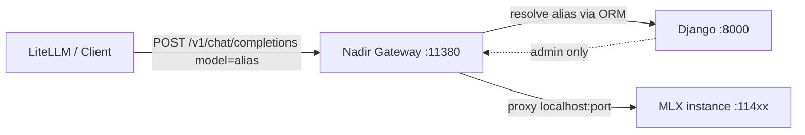

# ADR 001: Nadir Gateway — dedicated FastAPI inference plane

**Date:** 2026-06-21  
**Status:** Accepted

## Context

MLX Server today exposes a Django control plane on port `8000` and launches one OpenAI-compatible backend per model on ports `11400–11500`. Clients (LiteLLM, Open WebUI, custom scripts) must know each instance port and backend quirks (for example `default_model` on mlx-lm text servers).

We need a **single stable OpenAI-compatible entrypoint** on each Mac that:

- Routes requests by **gateway alias** (`model` field = `server_config.model_id`, see MLX-19)
- Proxies to the correct local MLX backend without putting Django/Gunicorn on the hot inference path
- Stays compatible with LiteLLM as the cluster-facing router in production

Wake-from-idle and automatic model loading are **out of scope** for the first gateway sprint.

## Decision

Introduce **Nadir Gateway**, a separate **FastAPI + uvicorn** worker:

| Plane | Process | Default port | Role |
|-------|---------|--------------|------|
| Control | Django `runserver` / WSGI | `8000` | Admin UI, downloads, instance lifecycle |
| Data | `python -m orchestrator.gateway` | `11380` | OpenAI-compatible proxy (`/v1/*`) |

Configuration:

- `NADIR_GATEWAY_PORT` (default `11380`) — **outside** the instance range `11400–11500`
- `NADIR_GATEWAY_HOST` (default `127.0.0.1` in production-style setups)
- Gateway bootstraps **Django ORM** (`django.setup()`) to read `InferenceInstance` and aliases from SQLite

Routing flow:

Port allocation policy:

| Range | Purpose |
|-------|---------|
| `8000` | Django UI |
| `11380` | Nadir Gateway (reserved, configurable) |
| `11400–11500` | MLX inference instances (auto-assigned) |

## Alternatives considered

| Option | Why rejected |
|--------|--------------|
| Django views as proxy | WSGI sync overhead; couples hot path to web admin process |
| Gunicorn + Django for `/v1` | Same as above; harder to stream SSE efficiently |
| LiteLLM-only routing (no local gateway) | Each Mac still needs per-port model entries; no unified alias registry tied to orchestrator state |
| New DB column for alias | `server_config.model_id` already exists and is validated (MLX-19) |

## Consequences

**Positive**

- One URL for all local models: `http://127.0.0.1:11380/v1`
- Alias registry stays in orchestrator DB; gateway is stateless aside from ORM reads
- FastAPI/uvicorn fits streaming chat proxy (MLX-22)
- Clear separation: control plane vs data plane

**Negative**

- Second process to run and monitor alongside Django
- Gateway must call `django.setup()` — slight startup cost, shared SQLite lock contention if heavily concurrent (acceptable for local-first use)
- Operators must ensure gateway port does not collide with instance ports

## References

- MLX-19: gateway alias on `server_config.model_id`
- MLX-20: gateway worker bootstrap
- MLX-21: alias → instance router
