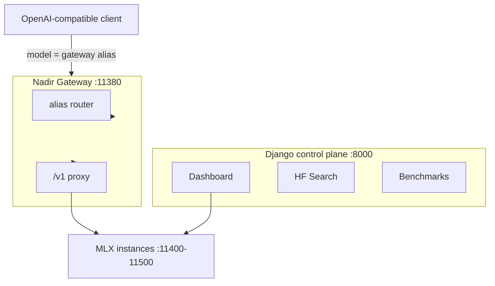

# Nadir MLX

**Local-first orchestrator for Apple Silicon MLX inference.**

Nadir MLX is a Django control plane that downloads Hugging Face models, launches OpenAI-compatible inference endpoints on your Mac, and benchmarks them — without sending prompts or weights to the cloud.

## Why Nadir MLX?

- **Search & download** MLX models from Hugging Face into `./models/`
- **Launch** one or more inference servers on dedicated ports (`11400–11500`)
- **Monitor** live logs and instance status from the browser
- **Benchmark** throughput, latency, and optional quality suites
- **Integrate** via the **Nadir Gateway** (`:11380/v1`) with any OpenAI-compatible client

Everything runs on your machine. Model weights, logs, and local database state stay on the Mac.

## Architecture

| Port | Service |
|------|---------|
| `8000` | Django admin UI |
| `11380` | Nadir Gateway (`NADIR_GATEWAY_PORT`) |
| `11400–11500` | MLX inference instances (auto-assigned) |

## Launch modes

| Mode | API (via gateway) |
|------|-------------------|
| **TEXT** | `POST /v1/chat/completions` |
| **MULTIMODAL** | `POST /v1/chat/completions` (vision) |
| **EMBEDDING** | `POST /v1/embeddings` |
| **RERANKER** | `POST /v1/rerank` |
| **IMAGE** | `POST /v1/images/generations` |
| **TTS** | `POST /v1/audio/speech` |
| **STT** | `POST /v1/audio/transcriptions` |

## Quick links

| Topic | Page |
|-------|------|
| Install on macOS | [Installation](installation.md) |
| Environment variables | [Configuration](configuration.md) |
| Gateway & curl examples | [Nadir Gateway](usage/nadir-gateway.md) |
| Wake / idle offload | [Instance lifecycle](usage/instance-lifecycle.md) |
| Quality benchmarks | [Quality benchmarks](usage/quality-benchmarks.md) |
| Common issues | [Troubleshooting](troubleshooting.md) |
| Contribute | [Contributing](contributing.md) |

Source code: [github.com/assiadialeb/nadir-mlx](https://github.com/assiadialeb/nadir-mlx)
