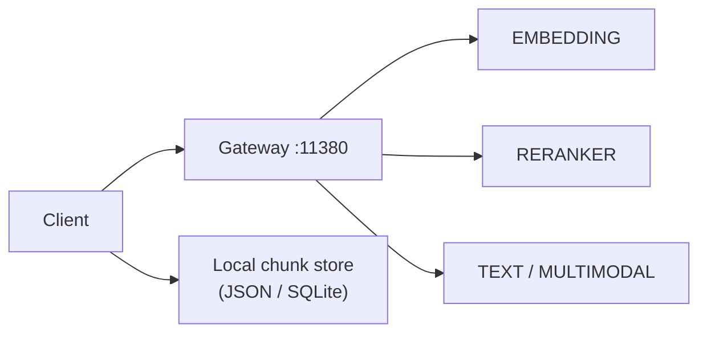

# Runbook — Local RAG (embed + rerank + chat)

End-to-end **privacy-first** retrieval stack through Nadir Gateway (`:11380`). All inference stays on the machine — no external embedding APIs, no cloud vector DB required for this playbook.

!!! note "Vela Suite consumers"
    Spectra and GitPulse can reuse the same gateway aliases when they need local semantic search or reranking. Point their HTTP clients at `NADIR_GATEWAY_HOST:NADIR_GATEWAY_PORT` with the aliases below.

## Recommended model trio

| Role | Launch mode | Example alias | Instance port (internal) |
|------|-------------|---------------|--------------------------|
| Embeddings | `EMBEDDING` | `nomic-embed-text` | e.g. `11440` |
| Reranker | `RERANKER` | `jina-reranker-v3` | e.g. `11441` |
| Generator | `TEXT` or `MULTIMODAL` | `qwen-chat` | e.g. `11442` |

Start all three instances in the Nadir UI (or via API), then confirm discovery:

```bash
curl -s http://127.0.0.1:11380/v1/models | python3 -m json.tool
```

## Architecture (loopback only)



1. **Chunk** documents offline (your app or script).
2. **Embed** chunks via `POST /v1/embeddings`.
3. **Retrieve** top-k by cosine similarity locally.
4. **Rerank** candidates via `POST /v1/rerank`.
5. **Generate** answer via `POST /v1/chat/completions` with injected context.

## 1. Embed document chunks

```bash
curl -s http://127.0.0.1:11380/v1/embeddings \
  -H "Content-Type: application/json" \
  -d '{
    "model": "nomic-embed-text",
    "input": [
      "Nadir MLX runs inference locally on Apple Silicon.",
      "The gateway exposes OpenAI-compatible routes on port 11380."
    ]
  }' | python3 -m json.tool
```

Store `data[i].embedding` vectors in your local index (file, SQLite, or in-memory for demos).

## 2. Rerank retrieved candidates

After your client selects candidate chunk texts for a user query:

```bash
curl -s http://127.0.0.1:11380/v1/rerank \
  -H "Content-Type: application/json" \
  -d '{
    "model": "jina-reranker-v3",
    "query": "How does Nadir expose APIs?",
    "documents": [
      "Nadir MLX runs inference locally on Apple Silicon.",
      "The gateway exposes OpenAI-compatible routes on port 11380."
    ],
    "top_n": 2,
    "return_documents": true
  }' | python3 -m json.tool
```

**Expected:** `results` sorted by `relevance_score`; the gateway route doc ranks highest.

## 3. Chat with retrieved context

Inject reranked passages into the system or user message:

```bash
curl -s http://127.0.0.1:11380/v1/chat/completions \
  -H "Content-Type: application/json" \
  -d '{
    "model": "qwen-chat",
    "messages": [
      {
        "role": "system",
        "content": "Answer using only the provided context. Say if context is insufficient."
      },
      {
        "role": "user",
        "content": "Context:\n- The gateway exposes OpenAI-compatible routes on port 11380.\n\nQuestion: Which port does the gateway use?"
      }
    ],
    "max_tokens": 256
  }' | python3 -m json.tool
```

## Minimal Python orchestration (stdlib + urllib)

```python
import json
import math
import urllib.request

GATEWAY = "http://127.0.0.1:11380"
EMBED_ALIAS = "nomic-embed-text"
RERANK_ALIAS = "jina-reranker-v3"
CHAT_ALIAS = "qwen-chat"

CHUNKS = [
    "Nadir MLX runs inference locally on Apple Silicon.",
    "The gateway exposes OpenAI-compatible routes on port 11380.",
]


def post(path: str, payload: dict) -> dict:
    request = urllib.request.Request(
        f"{GATEWAY}{path}",
        data=json.dumps(payload).encode("utf-8"),
        headers={"Content-Type": "application/json"},
        method="POST",
    )
    with urllib.request.urlopen(request, timeout=120) as response:
        return json.loads(response.read().decode("utf-8"))


def cosine_similarity(left: list[float], right: list[float]) -> float:
    dot = sum(a * b for a, b in zip(left, right))
    left_norm = math.sqrt(sum(a * a for a in left))
    right_norm = math.sqrt(sum(b * b for b in right))
    return dot / (left_norm * right_norm)


def main() -> None:
    query = "Which port does the gateway use?"
    embed_response = post("/v1/embeddings", {"model": EMBED_ALIAS, "input": CHUNKS + [query]})
    vectors = [row["embedding"] for row in embed_response["data"]]
    chunk_vectors, query_vector = vectors[:-1], vectors[-1]
    ranked = sorted(
        zip(CHUNKS, chunk_vectors),
        key=lambda item: cosine_similarity(query_vector, item[1]),
        reverse=True,
    )
    candidates = [text for text, _vector in ranked[:3]]
    rerank_response = post(
        "/v1/rerank",
        {
            "model": RERANK_ALIAS,
            "query": query,
            "documents": candidates,
            "top_n": 2,
            "return_documents": True,
        },
    )
    context_lines = [
        hit["document"]["text"]
        for hit in rerank_response["results"]
        if hit.get("document")
    ]
    chat_response = post(
        "/v1/chat/completions",
        {
            "model": CHAT_ALIAS,
            "messages": [
                {"role": "system", "content": "Answer from context only."},
                {
                    "role": "user",
                    "content": "Context:\n- "
                    + "\n- ".join(context_lines)
                    + f"\n\nQuestion: {query}",
                },
            ],
            "max_tokens": 128,
        },
    )
    print(chat_response["choices"][0]["message"]["content"])


if __name__ == "__main__":
    main()
```

## Lifecycle tips

| Concern | Recommendation |
|---------|----------------|
| Cold start | Set `on_demand` lifecycle on embed/rerank; first request wakes instances (see [instance lifecycle](../instance-lifecycle.md)). |
| Memory | Run smaller embed + rerank models; keep chat model separate. |
| Batch size | Embed multiple chunks per `input` array to reduce round-trips. |
| Security | Bind instances to `127.0.0.1` when the gateway is the only entry point. |

## Troubleshooting

| Symptom | Action |
|---------|--------|
| 404 on `model` | Verify alias in `GET /v1/models`. |
| 503 model unavailable | Start the EMBEDDING / RERANKER / TEXT instance in the UI. |
| Empty embeddings | Confirm EMBEDDING launch mode, not TEXT. |
| Rerank 400 on chat route | Use `POST /v1/rerank`, not `/v1/chat/completions`. |

## See also

- [Embeddings runbook](embedding.md)
- [Reranker runbook](reranker.md)
- [Chat runbook](chat.md)
- [Nadir Gateway overview](../nadir-gateway.md)
