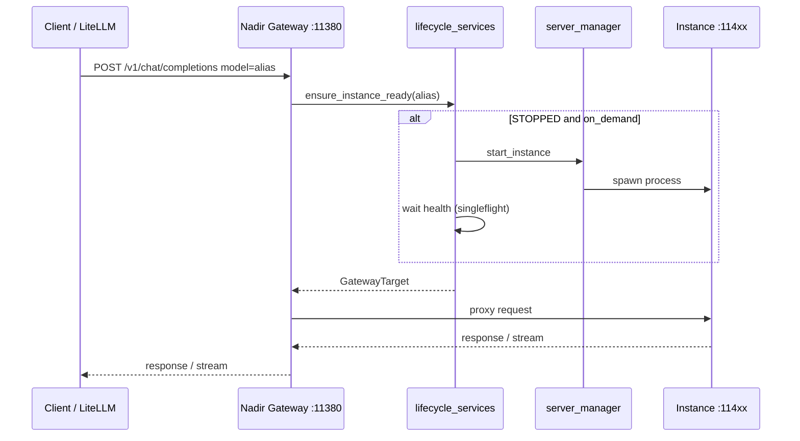

# Instance lifecycle — wake on demand & idle offload

Operator guide for Ollama-like **sleep / wake** behaviour on Nadir (MLX Server).

!!! note "Prerequisite"
    Nadir Gateway (`:11380`) must be running. See [nadir-gateway-litellm.md](nadir-gateway-litellm.md).

**Epic:** MLX-38 · **ADR:** [006-instance-wake-idle-offload.md](../adr/006-instance-wake-idle-offload.md)

## Concepts

| Term | Meaning |
|------|---------|
| **always_on** | Instance stays running until manually stopped (default, pre-v0.3 behaviour) |
| **on_demand** | Instance may be **stopped** when idle; gateway **wakes** it on first request |
| **Idle offload** | Background watcher stops `on_demand` instances after `idle_minutes` without traffic |
| **Cold start** | Time to load weights into unified memory after wake |

## Per-instance configuration

Set in the instance **server config** (UI advanced / ops section):

| Key | Values | Default |
|-----|--------|---------|
| `lifecycle_mode` | `always_on`, `on_demand` | `always_on` |
| `idle_minutes` | 5–1440 | `30` |

Recommendations:

- Primary chat model → `always_on`
- TTS, STT, image, reranker, secondary chat → `on_demand` with `idle_minutes` 15–60

## Environment variables

| Variable | Default | Description |
|----------|---------|-------------|
| `NADIR_GATEWAY_WAKE_TIMEOUT_SECONDS` | `300` | Max wait for instance to become RUNNING after wake |
| `NADIR_IDLE_OFFLOAD_ENABLED` | `true` | Global switch for idle watcher |
| `NADIR_IDLE_CHECK_INTERVAL_SECONDS` | `60` | How often idle candidates are evaluated |

## Request flow



## LiteLLM

Point all model routes to the same gateway:

```yaml
model_list:
  - model_name: nadir-gemma
    litellm_params:
      model: openai/gemma-chat
      api_base: http://127.0.0.1:11380/v1
      timeout: 300
      stream_timeout: 300
```

- Set **`timeout`** and **`stream_timeout`** ≥ `NADIR_GATEWAY_WAKE_TIMEOUT_SECONDS` for `on_demand` models.
- Large VLMs may need 180–300s on first request after sleep.
- LiteLLM only needs the **alias** in `model`; no per-instance port.

## Gateway errors

| HTTP | Code | When |
|------|------|------|
| 503 | `model_waking` | Wake in progress (rare if connection is held) |
| 503 | `model_waking_timeout` | Wake exceeded timeout |
| 503 | `model_unavailable` | `always_on` but stopped, or FAILED |

## Verification

1. Create instance with `lifecycle_mode: on_demand`, stop it from UI → status **Stopped**.
2. `curl` chat completion via gateway with `model: <alias>` → succeeds after cold start.
3. Wait `idle_minutes` + one check interval → instance returns **Stopped**, RAM freed.
4. `GET /v1/models` lists alias with `nadir.status` / `nadir.lifecycle_mode` extensions.

## Troubleshooting

| Symptom | Check |
|---------|--------|
| Immediate 503 on stopped alias | `lifecycle_mode` still `always_on` |
| Timeout on first request | Increase LiteLLM timeout and `NADIR_GATEWAY_WAKE_TIMEOUT_SECONDS` |
| Instance never sleeps | Traffic still hitting instance port directly (bypass gateway) |
| Instance sleeps during long stream | Bug — report; `last_used_at` should update at stream start |

## Related

- [Coverage matrix](nadir-gateway-coverage-matrix.md)
- [ADR 001 — Gateway](../adr/001-nadir-gateway.md)
